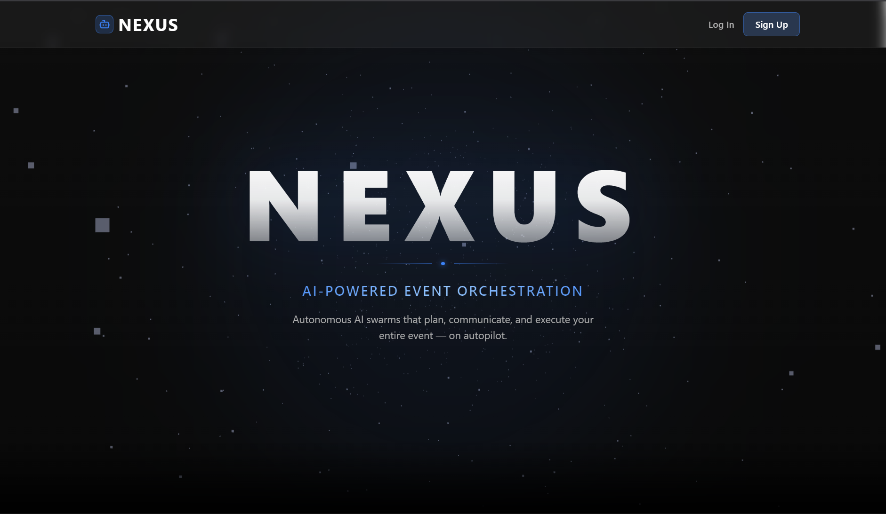
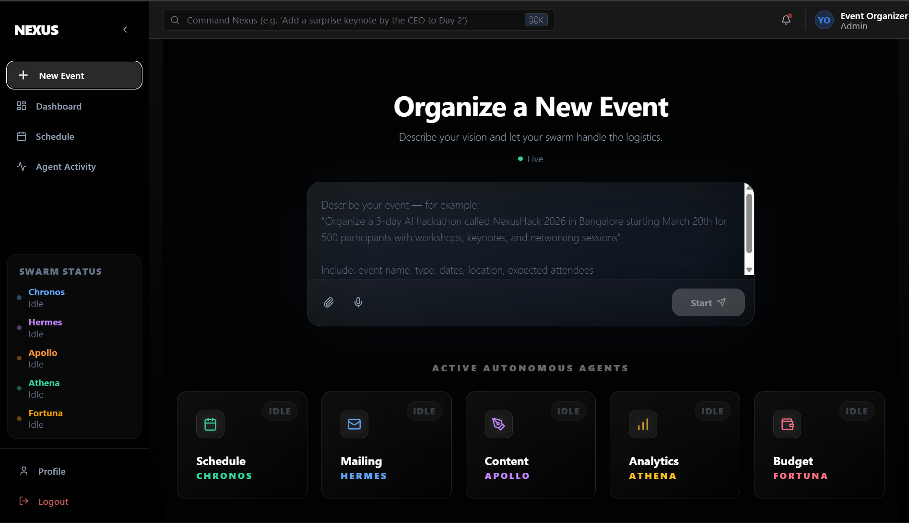
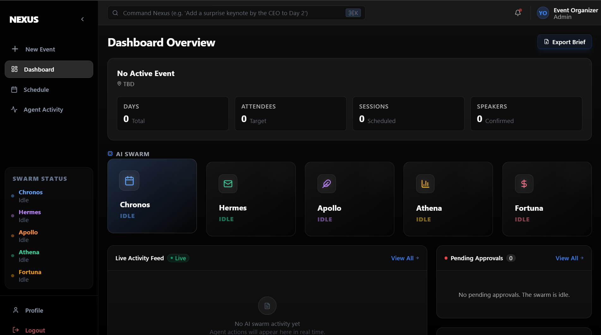
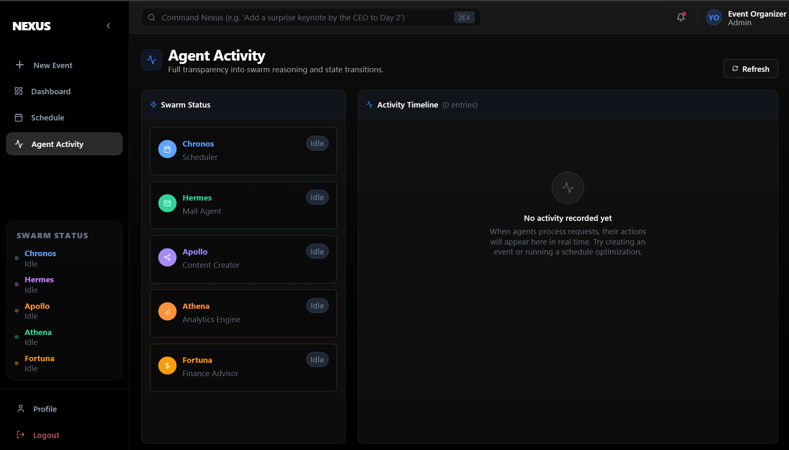

# Nexus — AI-powered command center for hackathon and event management

Built and won at Neurathon, organized by NIT Silchar, February 2026.

Nexus is a multi-agent web application where five autonomous LLM-powered agents collaborate in real-time to handle every operational dimension of a technical event: scheduling, participant communications, social media content, analytics, and budget. An organizer describes what they need in plain language, and the agent swarm handles the logistics, surfaces conflicts, proposes actions requiring approval, and coordinates across agents automatically. The system is technically interesting because agents are not called in a fixed pipeline — a LangGraph `StateGraph` routes requests dynamically, and agents can trigger one another through a cascading task queue evaluated after every agent run.

---

## Live Demo

**[Live Demo →](https://nexus-iota-navy.vercel.app/)**









---

## System Overview

The orchestrator exposes a single LangGraph `StateGraph` compiled at startup. Every natural language request enters at the `router` node, which classifies intent and dispatches to the appropriate agent. After each agent completes, an `evaluator` node inspects the output for cascading tasks and routes back into the graph — or ends if everything is resolved.

| Agent | Name | Responsibility |
|---|---|---|
| Scheduler | **Chronos** | Builds event timelines, detects room/speaker conflicts, resolves them by priority rules, triggers Hermes and Apollo when changes affect confirmed arrangements |
| Communications | **Hermes** | Drafts personalized bulk emails, segments participants by role/track, validates email formats, handles cascaded schedule-change notifications from Chronos |
| Content Strategist | **Apollo** | Generates platform-specific promotional copy (Twitter, LinkedIn, Instagram, Email), plans multi-phase campaign arcs, updates queued content when schedule changes |
| Analytics | **Athena** | Analyzes registration velocity, flags capacity mismatches and speaker confirmation risks, cascades to Apollo for urgency content or to Hermes for follow-up emails |
| Finance | **Fortuna** | Tracks budget line items, estimates cost impact of schedule changes, identifies sponsorship targets with tailored pitch angles, persists financial state across sessions |

**Coordination model:** Agents write structured JSON outputs that include an optional `cascade_to` field. The evaluator node reads this field and enqueues follow-on tasks. For example, when Chronos resolves a room conflict affecting 87 participants, it emits a `cascade_to` entry for Hermes (`notify_schedule_change`) and one for Apollo (`update_content`). The graph loops back to the router and executes those tasks in sequence without any additional input from the organizer.

Every agent action that has external effects (sending email, publishing content, applying a schedule change) is gated behind an approval step. The evaluator persists approval items to SQLite and broadcasts them to the frontend over WebSocket. The organizer approves or rejects before anything is dispatched.

---

## Features

- **Natural language command interface** — organizers type a request in plain English; the system classifies and routes it to the right agent automatically
- **Conflict-aware scheduling** — Chronos detects hard conflicts (room double-booking, speaker overlap) and soft conflicts (capacity warnings), resolves them by session-type priority, and explains its reasoning
- **Participant CSV ingestion** — upload a CSV with any reasonable column naming convention; the parser normalizes columns, validates emails, deduplicates, and loads participants into the agent context
- **Personalized bulk email** — Hermes segments the audience and generates preview emails with `{{placeholder}}` personalization; bulk dispatch is gated behind organizer approval
- **Social media content generation** — Apollo produces platform-appropriate copy (character limits, hashtag counts, tone) for Twitter, LinkedIn, Instagram, and email in a single request
- **Live agent activity panel** — inter-agent messages and status transitions stream to the dashboard via WebSocket in real time, making the multi-agent coordination visible
- **Finance and sponsorship dashboard** — Fortuna tracks spending by category, flags budget risks, and identifies potential sponsors with event-specific pitch angles

---

## Tech Stack

| Layer | Technology |
|---|---|
| **Frontend** | React 19, Vite, Tailwind CSS, Recharts, React Three Fiber, Lucide React |
| **Backend** | Python, FastAPI, LangGraph, LangChain, Google Gemini (`gemini-2.0-flash`) |
| **Database** | SQLite via aiosqlite (WAL mode), single-file persistence |
| **Real-time** | FastAPI WebSockets, custom `ConnectionManager` broadcasting to all connected clients |
| **Deployment** | Frontend on Vercel, Backend on Render |

---

## Getting Started

### Prerequisites

- Python 3.11+
- Node.js 18+
- A Google Gemini API key

### Backend

```bash
git clone https://github.com/SharadPandey01/Nexus.git
cd Nexus/backend

python -m venv venv
source venv/bin/activate        # Windows: venv\Scripts\activate
pip install -r requirements.txt

cp .env.example .env
# Edit .env and set GEMINI_API_KEY

uvicorn app.main:app --reload --port 8000
```

### Frontend

```bash
cd Nexus/frontend

npm install

cp .env.example .env
# .env already points to http://localhost:8000 for local development

npm run dev
```

Open `http://localhost:5173` in your browser.

---

## Project Structure

```
Nexus/
├── backend/
│   └── app/
│       ├── agents/          # Five LLM agents + LangGraph orchestrator
│       ├── api/
│       │   ├── routes/      # REST endpoints (events, upload, schedule, mail, content, approvals, etc.)
│       │   └── websocket.py # WebSocket connection manager and broadcast logic
│       ├── services/        # CSV parser, email sender, template engine, segmentation
│       ├── state/           # In-memory StateManager + event dispatcher (system event → agent mapping)
│       ├── database.py      # SQLite schema and connection lifecycle
│       ├── repository.py    # All database read/write functions
│       ├── config.py        # Pydantic Settings — single source of config
│       └── main.py          # FastAPI app, CORS, router mounts, startup/shutdown lifespan
├── frontend/
│   └── src/
│       ├── pages/           # Dashboard, Schedule, MailCenter, ContentStudio, Athena, Finance, Approvals
│       ├── components/      # UI components grouped by feature area (activity, schedule, mail, content, layout)
│       ├── hooks/           # Custom React hooks (WebSocket, API calls)
│       └── services/        # Axios-based API client
├── render.yaml              # Render deployment config
├── DEPLOY.md                # Step-by-step deployment guide (Render + Vercel)
└── nexus_participants.csv   # Sample participant data for testing
```

---

## Key Technical Decisions

**Graph-based orchestration over a fixed pipeline.** The team chose LangGraph's `StateGraph` rather than a linear chain because hackathon event management is inherently non-linear. A schedule change can require participant notifications, content updates, and a financial impact estimate — all triggered by a single organizer request. The graph's evaluator node inspects every agent output for `cascade_to` entries and re-enters the routing loop, letting the system execute multi-step workflows without the organizer having to issue intermediate commands. A safety counter caps iterations at 10 to prevent runaway loops from malformed LLM outputs. The `NexusState` TypedDict is the shared working memory for a single graph invocation; the in-memory `StateManager` singleton serves as the system's persistent working state across invocations.

**WebSockets as the primary push channel, not polling.** Agent execution is asynchronous and can take several seconds per LLM call. Rather than having the frontend poll for results, every agent node in the graph calls `await ws_manager.broadcast(...)` at key moments: when an agent starts, when it completes, when it emits an inter-agent handoff, and when it requests approval. This means the frontend receives a live stream of the agent swarm's activity, which made the system feel meaningfully different from a simple chatbot interface during the demo. The `ConnectionManager` maintains a list of active WebSocket connections and silently removes stale ones on the next broadcast, avoiding the need for heartbeat cleanup logic.

**Two-layer state: in-memory + SQLite.** The team separated fast read/write access (the `StateManager` singleton) from durable persistence (aiosqlite with WAL mode). Agents read participant lists, schedule, and content queues directly from memory on every invocation, which avoids async database round-trips on the hot path. Writes go to both layers: the state manager is updated immediately, and an async database insert runs concurrently. On server startup, the lifespan handler rehydrates the state manager from the most recent active event in SQLite, so a Render cold start does not lose context. This tradeoff accepts eventual consistency between the two layers in exchange for lower latency on agent reads.

---

## Team

| Name | GitHub |
|---|---|
| Yash Srivastava | [@yash1732](https://github.com/yash1732) |
| Sharad Pandey | [@SharadPandey01](https://github.com/SharadPandey01) |
| Aalok Singh | [@Aalok-singh05](https://github.com/Aalok-singh05) |
| Madhav Gaba | [@madhav-0000](https://github.com/madhav-0000) |

---

## Acknowledgements

Built at Neurathon 2026, organized by NIT Silchar.